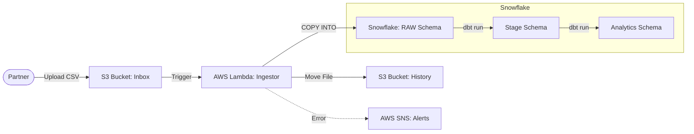

# Retail Data Pipeline 🚀

A robust, Serverless data pipeline designed to ingest, validate, and process retail data scale using **AWS** and **Snowflake**.


## 📋 Overview

This project implements an ELT (Extract, Load, Transform) pattern:
1.  **Extract**: Partners upload CSV files (`Sales` or `Stores`) to an S3 Inbox.
2.  **Load**: AWS Lambda triggers instantly, validating the file and executing a Snowflake `COPY INTO` command to load raw data.
3.  **Transform**: **dbt** (Data Build Tool) cleans, deduplicates, and models the data into analytical tables.

### Architecture Flow


---

## 🛠️ Prerequisites

*   **AWS CLI** installed and configured (`v2+`).
*   **Snowflake Account** (Standard or higher).
*   **Python 3.9+** and `pip`.
*   **git**.

---

## 🚀 Getting Started

### 1. Configure AWS Credentials
This project uses a specific AWS Profile for security. Add this to your `~/.aws/credentials`:

```ini
[snowflake-project]
aws_access_key_id = <YOUR_ACCESS_KEY>
aws_secret_access_key = <YOUR_SECRET_KEY>
region = us-east-1
```

### 2. Setup Snowflake Environment
Run the setup scripts in your Snowflake Worksheet (as `ACCOUNTADMIN`):
1.  `infrastructure/snowflake/01_setup_database.sql` (Creates DB, Warehouse, Integration).
2.  `infrastructure/snowflake/02_setup_security.sql` (Creates Users & Roles).
3.  `infrastructure/snowflake/03_setup_raw_tables.sql` (Creates Tables).

### 3. Deploy Infrastructure
We use a unified Bash script to package and deploy the AWS stack (Lambda, S3, IAM).

```bash
cd scripts/
./deploy.sh
```
*You will be prompted for your Snowflake Password during deployment.*

---

## 💻 Usage

To process data, simply upload a file to the S3 `inbox/` folder.

**Upload Sales Data:**
```bash
aws s3 cp test_data/sales_20250111.csv s3://<YOUR_BUCKET_NAME>/inbox/ --profile snowflake-project
```

**What happens next?**
1.  File lands in `inbox/`.
2.  Lambda detects file type (`store` vs `sale`) and extracts Batch Date from filename.
3.  Data is loaded into `RAW.STORES` or `RAW.SALES`.
4.  File is moved to `history/<type>/year=YYYY/month=MM/day=DD/`.
5.  If error: File stays in `inbox/` and you receive an alert.

---

## 🔧 Engineering Decisions

### Handling "Optional Headers"
*   **Problem**: Files may or may not have headers.
*   **Solution**: `SKIP_HEADER = 0` (Read all lines). We filter the header row downstream in **dbt** using `WHERE col != 'col_name'`.
*   **Why**: Prevents data loss if a file without header is wrongly skipped.

### Batch Date Extraction
*   **Problem**: Filename contains critical "Batch Date" metadata not present in row data.
*   **Solution**: Lambda RegEx extracts date -> Python injects it into `COPY INTO` command -> Persisted in `batch_date` column.

---

## 📂 Repository Structure

```text
/
├── dbt_project/            # dbt Models & Config (Phase 4)
├── infrastructure/         
│   ├── cloudformation/     # AWS Stack (template.yaml)
│   └── snowflake/          # SQL DDLs for Database setup
├── lambda_functions/       # Python Source Code for Ingestion
├── scripts/                # Deployment utilities
├── test_data/              # Sample CSVs for QA
└── README.md               # You are here
```
